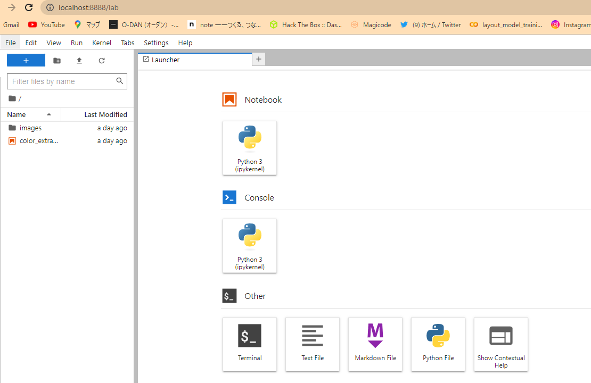

# Jupyterlab


# Index

- [Jupyterlab](#jupyterlab)
- [Index](#index)
  - [Introduction](#introduction)
  - [Quick Start](#quick-start)
  - [Detail](#detail)
  - [Reference site](#reference-site)

## Introduction

秒速で構築できる`Jupyterlab`の環境です．
外部からのアクセスも可能です．

## Quick Start

起動させるために必要なコマンドをここに書きます．

下記のコマンドでコンテナが起動します．

```bash
docker-compose up
```


`http://localhost:8888/`ここにアクセスすることで`Jupyterlab`を開くことができます．




## Detail

`docker-compose.yml`

```Dockerfile
version: '3'
services:
  jupyterlab:
    build: .
    restart: always # 自動起動します
    tty : true      # コンテナが落ちないようにする
    expose:
      - "8888"
    ports:          # ホストのポートとコンテナのポートを繋げます
      - "8888:8888"
    volumes:        # 作業フォルダをマウントします
      - ./workspace:/workspace
    working_dir: /workspace

    command:        # 起動時のコマンドを指定します
      jupyter-lab --ip 0.0.0.0 --allow-root --NotebookApp.token='' --port=8888 --notebook-dir=/workspace -b localhost
```

`Dockerfile`

```Dockerfile
FROM python:3.11-rc-slim-bullseye

# -------------------------------
# package
#
RUN apt-get update
RUN apt-get  install -y build-essential libffi-dev
# RUN apk add build-base 

# -------------------------------
# Python
#
RUN pip install wheel setuptools pip --upgrade
RUN python -m pip install jupyterlab
```

## Reference site

- [DockerでJupyterLabの環境を作ろう](https://www.idnet.co.jp/column/page_187.html)
- [【簡単】JupyterlabをDockerで起動](https://zenn.dev/en2enzo2/articles/78d57ec01ed0c5)
- [【docker-compose】JupyterLab立ち上げセット](https://zenn.dev/k8shiro/articles/my-docker-jupyterlab)
- [【Docker】3分でjupyterLab(python)環境を作る！](https://qiita.com/higakin/items/edf71435d0565257f980)